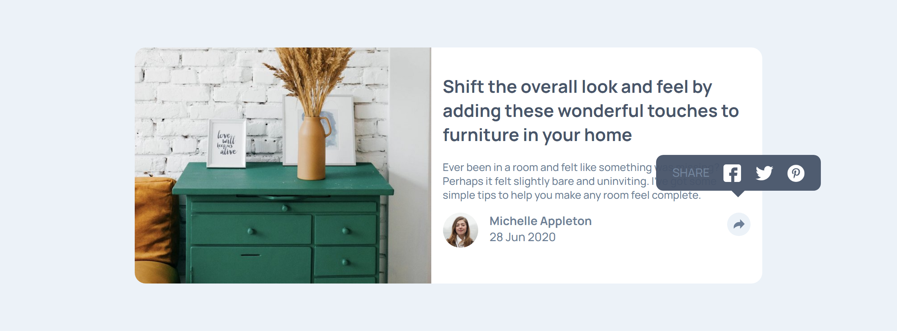

# Article priview card
front-end mentor project

This is a solution to the [Article preview component challenge on Frontend Mentor](https://www.frontendmentor.io/challenges/article-preview-component-dYBN_pYFT). Frontend Mentor challenges help you improve your coding skills by building realistic projects. 

## Table of contents

- [Overview](#overview)
  - [The challenge](#the-challenge)
  - [Screenshot](#screenshot)
  - [Links](#links)
- [My process](#my-process)
  - [Built with](#built-with)
  - [What I learned](#what-i-learned)
  - [Continued development](#continued-development)
  - [Useful resources](#useful-resources)
- [Author](#author)

**Note: Delete this note and update the table of contents based on what sections you keep.**

## Overview

### The challenge

Users should be able to:

- View the optimal layout for the component depending on their device's screen size
- See the social media share links when they click the share icon

### Screenshot



### Links

- Solution URL: [Add solution URL here](https://github.com/kimanthigregory/article-priview-card.git)
- Live Site URL: [Add live site URL here](https://kimanthigregory.github.io/article-priview-card/)

## My process

### Built with

- Semantic HTML5 markup
- CSS custom properties
- Flexbox
- CSS Grid

### What I learned


```css
@keyframes remove-animation {
    0%{right: 0.5rem; top: -5rem; opacity: 1;}    
    100%{right: 0.5rem; top: -3.5rem; opacity: 0;}
}
```

### Continued development
I have definetly enjoyed working with css animation, it is an area I would like to explore more and create seamless animations. I am still a newbie when it comes to javascript so i will continue to take on more intermidiete projects to level up my skills.
### Useful resources

- google

## Author

- Website - [Gregory kimanthi](https://kimanthigregory.github.io/portfolio-website/)
- Twitter - [@techboy_gabriel](https://www.twitter.com/techboy_gabriel)
